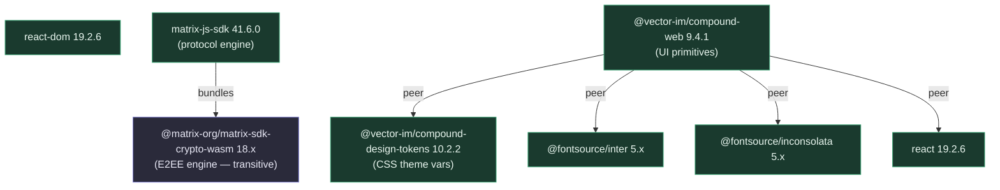
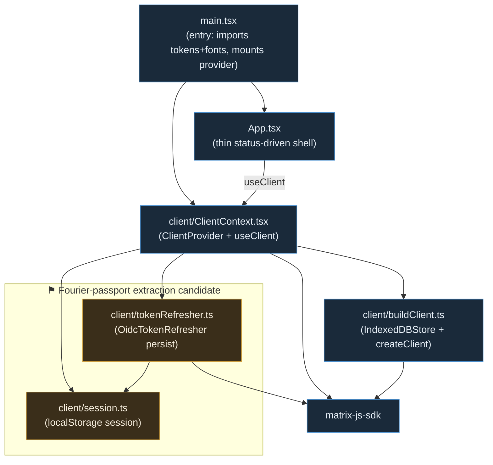

# Technetium — Dependency Chart & Manifest

Deliberate version choices and the dependency structure of the Technetium client.
Companion to the Fourier `DEPENDENCIES.md`; same "record decisions, not the whole
resolved tree" discipline (`package-lock.json` is authoritative for the full tree).

Last verified: 2026-06-20.

---

## Dependency graph

### External packages

### Internal module graph (`src/`)

The flagged modules (`session.ts`, `tokenRefresher.ts`) plus the login flow are a
reusable browser-side MAS-auth library — the client-side counterpart to the planned
**fourier-passport**. Kept inside Technetium for now; deliberately free of
client-specific deps so a later extraction is a move, not a rewrite.

---

## Version table

| Package | Version | Constraint / reason |
|---|---|---|
| `matrix-js-sdk` | `41.6.0` | Protocol engine + OIDC. Stay on stable (latest tag is an RC). Bundles crypto-wasm. |
| `@matrix-org/matrix-sdk-crypto-wasm` | `18.x` | **Transitive** via js-sdk (`^18.2.0`). Never pinned directly. Powers E2EE when activated. |
| `react` / `react-dom` | `19.2.6` | Satisfies Compound's `^18 \|\| ^19` peer range. |
| `@vector-im/compound-web` | `^9.4.1` | Element's design system — UI primitives. |
| `@vector-im/compound-design-tokens` | `^10.2.2` | Theme CSS vars (`--cpd-*`); light/dark via prefers-color-scheme. |
| `@fontsource/inter` | `^5.2.8` | UI font. Weights 400/500/600/700 imported. |
| `@fontsource/inconsolata` | `^5.2.8` | Mono font. Weight 400 imported. |
| `vite` | `8.0.14` | Dev server + build. |
| `typescript` | (scaffold) | — |

### Deferred (install when the phase needs them)
- `dompurify` — mandatory before rendering message HTML (Phase: timeline).
- `@matrix-org/matrix-wysiwyg` — rich composer (Phase: composer).
- `matrix-widget-api` — only if widgets are embedded (later/maybe).

---

## License note

All current dependencies are permissively licensed (matrix-js-sdk: Apache-2.0;
Compound: Apache-2.0; fontsource: OFL fonts + MIT tooling), imposing no copyleft
floor. Technetium itself is AGPL-3.0 by choice, not obligation. Re-check with a
license pass before any public release if new deps are added.
